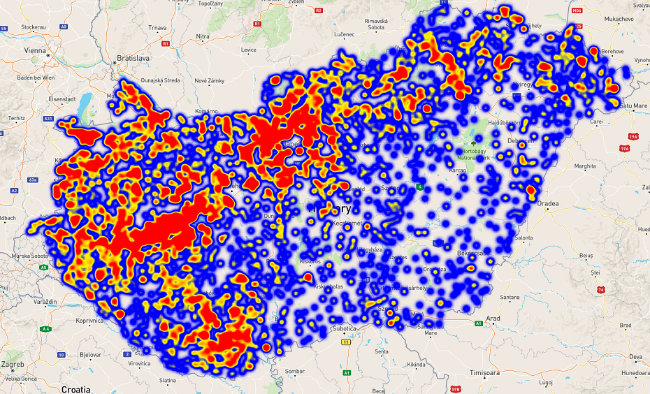
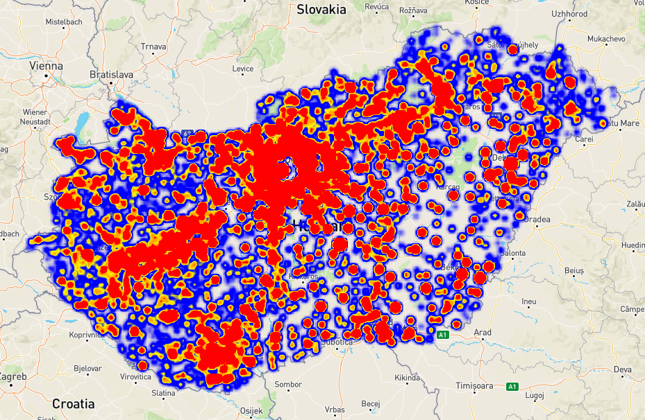

# Webcraping With Geocoding Example

### This script creates geojson file from the Hungarian real estate market, using data from [ingatlan.com](https://ingatlan.com/)
#### It uses webscraping to get all the data needed to create the geojson (it takes ~30 minutes to get all the necessary data from around 6000 pages - total of ~100.000 entries)
#### The script assigns coordinates to the collected entries
#### The script also creates a file with the average price per cities

## Here is an example of a geojson file created by the script and loaded into Mapbox GL (heatmap example):

### Average prices by settlement:

### All settlements:

